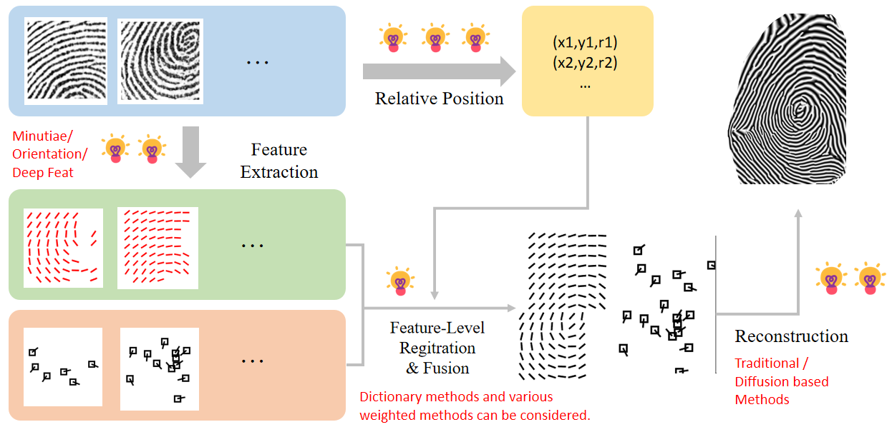
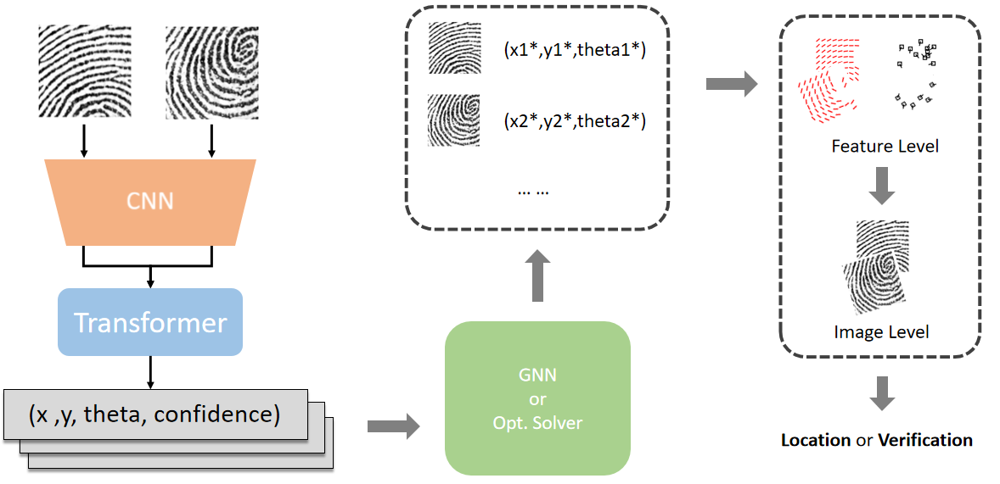

# FpReconstruction

<h5 align="left"> If our project helps you, please give us a star ⭐ on GitHub to support us. 🙏🙏 </h2>

<br>

 


### :speech_balloon: This repository is a partial code release related to:

- **_Arxiv 2026_**: **Toward the Whole Picture: Accumulative Fingerprint Mapping and Reconstruction for Small-Area Mobile Sensors**
  
<a href="https://arxiv.org/pdf/2606.15574" style="text-decoration: none;"></a>

[Xiongjun Guan](https://xiongjunguan.github.io/), Jianjiang Feng, Jie Zhou


---

## :art: Introduction

MATLAB codebase for reconstructing a larger fingerprint pattern from one or multiple partial fingerprint patches. The current project focuses on feature extraction, feature-level fusion, and phase-based fingerprint reconstruction, and it also includes example data and workflow figures for organizing the repository as a public GitHub project.


## :eyes: Overview

This repository organizes a MATLAB prototype for fingerprint reconstruction from partial observations. The code in this repo mainly covers:

- orientation field estimation from patch images
- minutiae loading and fusion
- feature-level registration and merging
- phase-based fingerprint reconstruction with iterative ridge filtering

The high-level pipeline, as reflected by `./images/overview.PNG`, can be understood as:

1. Multiple partial fingerprint patches are observed from different relative positions.
2. Each patch is converted into intermediate features such as orientation and minutiae.
3. The features are aligned and fused into a larger fingerprint representation.
4. A reconstruction module converts the fused representation into a dense fingerprint image.
<p align="center">
  
</p>

## :sparkles: Implementation View


The figure suggests a broader implementation framework around the current MATLAB prototype:

- patch inputs can first be encoded by a learned frontend such as a CNN or Transformer
- each patch may produce pose or registration cues such as `(x, y, theta, confidence)`
- a graph module or optimization solver can estimate relative spatial layout between patches
- fusion can happen at the feature level first, and then be lifted to image-level reconstruction
- the final output can support downstream localization or verification tasks

In other words, the current MATLAB code is best viewed as the reconstruction-oriented part of a larger system. It already contains the traditional feature extraction and reconstruction logic, while the figure also leaves room for learning-based registration or fusion modules.

<p align="center">
  
</p>

<br>

## :file_folder: Repository Structure

```text
fingerprint-reconstruction-matlab/
|- README.md
|- images/
|  |- overview.PNG
|  |- network.PNG
|- examples/
|  |- data/                  # demo data used by reconstruction scripts
|  |- datas/                 # auxiliary visualization assets
|- matlab/
|  |- demos/
|  |  |- run_single_reconstruction.m
|  |  |- run_two_patch_reconstruction.m
|  |  |- run_multi_patch_reconstruction.m
|  |- scripts/
|  |  |- prepare_cropped_patches_example.m
|  |  |- visualize_orientation_examples.m
|  |  |- generate_grid_background.m
|  |- startup.m
|  |- src/
|  |  |- core/
|  |  |- io/
|  |  |- utils/
```

<br>

## :pushpin:  Main Components

### Demo scripts

- `matlab/demos/run_single_reconstruction.m`
  Runs a single-image reconstruction example using a provided orientation field and minutiae file.
- `matlab/demos/run_two_patch_reconstruction.m`
  Merges two partial patches and reconstructs a larger fingerprint.
- `matlab/demos/run_multi_patch_reconstruction.m`
  Fuses multiple partial patches from one sequence and reconstructs the final print.

### Core functions

- `ReconstructFingerprint.m`
  Baseline reconstruction pipeline using minutiae and orientation information.
- `ReconstructFingerprint_Guan.m`
  Variant used by the multi-patch fusion demos.
- `DetectSpiral2.m`
  Detects spiral singularities from phase and direction fields.
- `UnwrapOrientationField.m`
  Unwraps the orientation field before reconstruction.
- `FitHoleDir.m`
  Fills unreliable or missing orientation regions.


## :rocket: Quick Start

Open MATLAB in the repository root and run:

```matlab
run(fullfile('matlab', 'startup.m'));
run(fullfile('matlab', 'demos', 'run_two_patch_reconstruction.m'));
```

Or try the multi-patch demo:

```matlab
run(fullfile('matlab', 'startup.m'));
run(fullfile('matlab', 'demos', 'run_multi_patch_reconstruction.m'));
```

<br>

## :warning: Notes on This Public Version

- Absolute paths from the original prototype have been replaced with relative repository paths in the demo scripts.
- Example data has been kept under `examples/` for easier reproduction.
- The repository has been reorganized to separate demos, core code, utilities, figures, and documentation.
- Some upstream dependencies are still missing from the provided snapshot, so this version should be treated as a cleaned and documented research prototype.

## :bulb: Possible Future Extensions

Based on the workflow figure, this repository can be naturally extended toward:

- learned patch registration
- confidence-aware multi-patch fusion
- feature-to-image reconstruction with diffusion or hybrid generative methods
- fingerprint verification or localization on top of reconstructed outputs

<br>

## :+1: Acknowledgment

A significant portion of this repository builds upon prior work on fingerprint reconstruction (see the citation below). Inspired by that pioneering research, I developed the original method presented here for sequence fingerprint reconstruction. 

This work would not have been possible without the insights and foundations provided by the original authors. **I am merely standing on the shoulders of giants.**

<br>

## :bookmark_tabs: Citation

If you find this repository useful, please give us stars and use the following BibTeX entry for citation.


```text
@ARTICLE{feng2013fingerprint,
  author={Feng, Jianjiang and Jain, Anil K.},
  journal={IEEE Transactions on Pattern Analysis and Machine Intelligence}, 
  title={Fingerprint Reconstruction: From Minutiae to Phase}, 
  year={2011},
  volume={33},
  number={2},
  pages={209-223},
  doi={10.1109/TPAMI.2010.77}}
```


<br>

## :triangular_flag_on_post: License

This project is released under the MIT license. Please see the LICENSE file for more information.

<br>

---

## :mailbox: Contact Me

If you have any questions about the code, please contact:
Xiongjun Guan gxj21@mails.tsinghua.edu.cn
